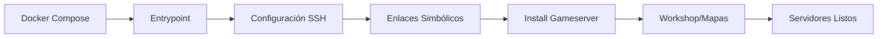

# Docker-L4D2-Competitive

[](https://hub.docker.com/r/aocgamers/lgsm-l4d2-competitive)
[](https://github.com/AoC-Gamers/Docker-L4D2-Competitive)

**Contenedor Docker para servidores competitivos de Left 4 Dead 2** con configuración automática, gestión de workshop, clonación de servidores y scripts de post-procesamiento Git.

## 🚀 Inicio Rápido

```bash
# 1. Clonar el repositorio
git clone https://github.com/AoC-Gamers/Docker-L4D2-Competitive.git
cd Docker-L4D2-Competitive

# 2. Configurar variables básicas
cp example.env .env
nano .env  # Editar LGSM_PASSWORD y SSH_PORT

# 3. Iniciar el contenedor
docker-compose up -d

# 4. Acceder por SSH (opcional)
ssh linuxgsm@localhost -p 2222
```

> **⚠️ Volumen Obligatorio**: El volumen `comp_data:/data` es **crítico** para persistir configuraciones, mapas y datos del servidor.

## ✨ Características Principales

- **🔧 Configuración Automática**: Instalación y configuración completa del servidor L4D2
- **🎮 Servidores Múltiples**: Clonación automática de instancias L4D2 independientes
- **📦 Steam Workshop**: Descarga automática de colecciones y artículos (con procesamiento por lotes)
- **🗺️ Gestión de Mapas**: Descarga desde L4D2Center con verificación MD5
- **🌿 Ramas Dinámicas**: Sistema `BRANCH_*` para usar diferentes versiones por entorno
- **🔗 Enlaces Simbólicos**: Actualizaciones automáticas de scripts vía `symlink.sh`
- **📊 Menú Interactivo**: Control centralizado de todos los servidores

## 🏗️ Arquitectura del Sistema

### Directorios Clave
- **`/app/`** (No persistente): Scripts actualizables con nuevas versiones
- **`/data/`** (Persistente): Gameserver, configuraciones, logs y datos de usuario
- **Enlaces simbólicos**: Conectan `/app` con `/data` para coherencia automática

### Flujo de Trabajo


## 📊 Variables de Entorno Principales

| Variable | Descripción | Ejemplo |
|----------|-------------|---------|
| `LGSM_PASSWORD` | Contraseña SSH (obligatorio) | `mi_password_seguro` |
| `SSH_PORT` | Puerto SSH del contenedor | `2222` |
| `BRANCH_SIR` | Rama del repo L4D2-Competitive-Rework | `development` |
| `L4D2_NO_INSTALL` | Evitar instalación automática | `false` |
| `GIT_FORCE_DOWNLOAD` | Forzar descarga de repositorios | `false` |

Ver [configuración completa](docs/configuration.md) para todas las opciones.

## 🎯 Casos de Uso

### Desarrollo
```yaml
environment:
  - BRANCH_SIR=development
  - GIT_FORCE_DOWNLOAD=true
  - DEBUG_MODE=true
```

### Producción
```yaml
environment:
  - LGSM_PASSWORD=${LGSM_PASSWORD}
  - SSH_KEY=${SSH_KEY}
  # Sin BRANCH_* = usa ramas estables
```

## 📚 Documentación Completa

| Documento | Descripción | Para quién |
|-----------|-------------|------------|
| **[🚀 Inicio Rápido](docs/quick-start.md)** | Instalación y primeros pasos | Nuevos usuarios |
| **[⚙️ Configuración Avanzada](docs/configuration.md)** | Variables, workshop, múltiples servidores | Usuarios experimentados |
| **[📜 Scripts](docs/scripts.md)** | Referencia completa de todos los scripts | Administradores |
| **[� Diagramas de Flujo](docs/flowcharts.md)** | Flujos visuales de instalación | Desarrolladores |
| **[🔧 API Reference](docs/api-reference.md)** | Funciones y APIs técnicas | Integradores |
| **[🐛 Troubleshooting](docs/troubleshooting.md)** | Solución de problemas | Todos |
| **[👨‍💻 Desarrollo](docs/development.md)** | Contribuir al proyecto | Contribuidores |

## 🛠️ Requisitos del Sistema

- **Docker**: 20.10+ y Docker Compose 1.29+
- **RAM**: 4GB mínimo, 8GB recomendado para producción
- **Almacenamiento**: 20GB disponibles (50GB+ para producción)
- **Red**: Conexión estable (descarga inicial ~10GB)

## 🚨 Información Importante

### ⚠️ Primera Instalación
- **Tiempo**: 30-60 minutos (dependiendo de conexión)
- **Descarga**: ~8GB de L4D2 + ~2GB de configuraciones competitivas
- **Volumen Docker**: **OBLIGATORIO** para persistir datos

### 🔐 Seguridad
- Cambiar `LGSM_PASSWORD` por defecto
- Configurar claves SSH para acceso remoto seguro
- Revisar configuración de puertos según entorno

## 🤝 Contribuir y Soporte

### 🐛 Reportar Problemas
[**Issues**](https://github.com/AoC-Gamers/Docker-L4D2-Competitive/issues) • [**Releases**](https://github.com/AoC-Gamers/Docker-L4D2-Competitive/releases)

### 🤝 Contribuir
1. Fork del repositorio
2. Crear rama: `git checkout -b feature/mejora-increible`
3. Commit: `git commit -m 'Add mejora increible'`
4. Push: `git push origin feature/mejora-increible`
5. Abrir Pull Request

Ver [Guía de Desarrollo](docs/development.md) para requisitos y estándares.

### 🙏 Agradecimientos
- [GameServerManagers/LinuxGSM](https://github.com/GameServerManagers/LinuxGSM) - Base de gestión de servidores
- [SirPlease/L4D2-Competitive-Rework](https://github.com/SirPlease/L4D2-Competitive-Rework) - Configuración competitiva
- [Geam/steam_workshop_downloader](https://github.com/Geam/steam_workshop_downloader) - Herramienta de workshop

## 📜 Licencia

Distribuido bajo la [**Licencia MIT**](LICENSE). Ver `LICENSE` para más información.

---

<div align="center">

**¿Nuevo en el proyecto?** → [Guía de Inicio Rápido](docs/quick-start.md)  
**¿Tienes problemas?** → [Troubleshooting](docs/troubleshooting.md)  
**¿Quieres contribuir?** → [Guía de Desarrollo](docs/development.md)

</div>
