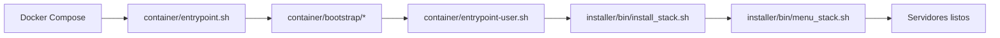

# Docker-L4D2-Competitive

Docker-L4D2-Competitive es el framework base para desplegar y operar entornos competitivos de Left 4 Dead 2 sobre LinuxGSM y Docker.

El diseño actual separa tres capas:

1. `container/`: bootstrap del contenedor y runtime base.
2. `installer/`: comandos y librerias del framework de instalacion.
3. `stack/`: catalogo instalable, perfiles y hooks.

## Inicio Rapido

```bash
git clone https://github.com/AoC-Gamers/Docker-L4D2-Competitive.git
cd Docker-L4D2-Competitive
cp example.env .env
docker-compose up -d
```

El volumen `comp_data:/data` sigue siendo obligatorio para persistir serverfiles, configuraciones, logs, snapshots del stack y estado del installer.

## Modelo de Arquitectura

### Arbol principal

```text
Docker-L4D2-Competitive/
├── container/
│   ├── entrypoint.sh
│   ├── entrypoint-user.sh
│   └── bootstrap/
├── installer/
│   ├── bin/
│   ├── lib/
│   └── config/
├── stack/
│   ├── manifests/
│   ├── profiles/
│   ├── hooks/
│   └── preserve-paths.json
├── config-lgsm/
└── docs/
```

### Flujo de arranque


```mermaid
graph LR
    A[Docker Compose] --> B[container/entrypoint.sh]
    B --> C[container/bootstrap/*]
    C --> D[container/entrypoint-user.sh]
    D --> E[installer/bin/install_stack.sh]
    E --> F[installer/bin/menu_stack.sh]
    F --> G[Servidores listos]
```

## Conceptos Clave

### Installer

El framework operativo vive en `installer/`.

- `installer/bin/install_stack.sh`: instala o actualiza el stack materializado.
- `installer/bin/sync_instances.sh`: sincroniza multiples instancias sobre la instancia primaria.
- `installer/bin/menu_stack.sh`: control operativo del runtime.
- `installer/lib/tools_stack.sh`: utilidades compartidas.

### Stack

El catalogo instalable vive en `stack/`.

- `stack/manifests/components.json`: define el catalogo completo de componentes y sus fuentes.
- `stack/profiles/*.json`: selecciona componentes y overrides por entorno.
- `stack/hooks/*.sh`: hooks por componente.

### Overrides de entorno

El bootstrap soporta dos formas de seleccionar variantes:

1. `STACK_PROFILE`: elige el perfil completo.
2. `BRANCH_*` y `RELEASE_TAG_*`: aplican overrides puntuales durante la compilacion del stack.

## Variables Importantes

| Variable | Descripcion | Ejemplo |
|----------|-------------|---------|
| `LGSM_PASSWORD` | Contrasena SSH | `mi_password_seguro` |
| `SSH_PORT` | Puerto SSH | `2222` |
| `STEAM_USER` | Usuario Steam para instalacion oficial | `mi_usuario_steam` |
| `STEAM_PASSWD` | Contrasena Steam | `mi_contrasena` |
| `L4D2_INSTALL` | Modo de instalacion base: `normal`, `skip`, `force` | `normal` |
| `L4D2_AUTOSTART` | Controla el inicio automatico del servidor | `true` |
| `L4D2_STACK_AUTOUPDATE` | Ejecuta `install_stack.sh update` antes del arranque de los gameservers | `false` |
| `L4D2_UPDATER` | Habilita o deshabilita el updater legacy de la base | `true` |
| `STACK_PROFILE` | Perfil de stack a materializar | `default` |
| `GIT_FORCE_DOWNLOAD` | Fuerza redescarga de fuentes remotas | `false` |
| `GITHUB_TOKEN` | Token opcional para releases/API | `ghp_xxx` |

Credenciales sensibles, como `STEAM_PASSWD`, deben ir en `.env.secrets`. `GEOIPUPDATE_LICENSE_KEY` se mantiene en `.env` para que el updater pueda ejecutarse manualmente en runtime.

## Documentacion

- `docs/quick-start.md`: instalacion basica.
- `docs/configuration.md`: variables, perfiles y configuracion avanzada.
- `docs/scripts.md`: mapa del bootstrap, installer y stack.
- `docs/api-reference.md`: contratos tecnicos y variables internas.
- `docs/l4d2-updater.md`: actualizaciones automaticas del binario del juego.

## Licencia

Distribuido bajo la licencia MIT. Consulta `LICENSE`.
