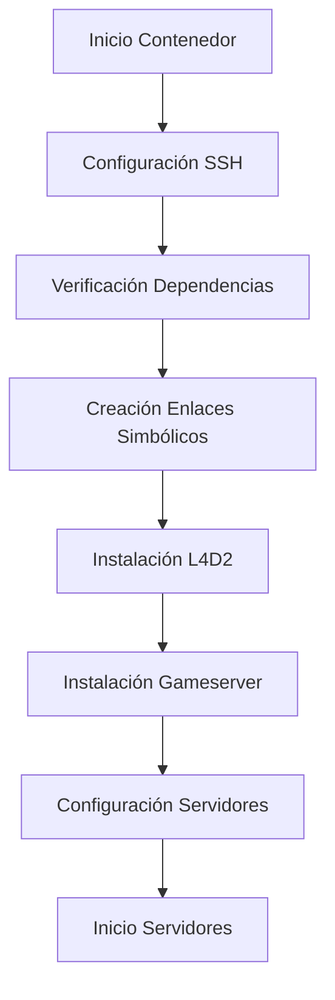

# Documentación Docker-L4D2-Competitive

Bienvenido a la documentación completa del proyecto Docker-L4D2-Competitive, un contenedor Docker orientado al despliegue y gestión de servidores competitivos de Left 4 Dead 2.

## 📚 Índice de Documentación

### 🚀 Primeros Pasos
- **[Guía de Inicio Rápido](quick-start.md)** - Instalación y configuración básica
- **[Configuración Avanzada](configuration.md)** - Opciones detalladas y personalización

### 🔧 Gestión y Operación
- **[L4D2Updater](l4d2-updater.md)** - Sistema de actualizaciones automáticas con Valve
- **[Documentación de Scripts](scripts.md)** - Referencia completa de todos los scripts
- **[Diagramas de Flujo](flowcharts.md)** - Flujos de instalación y subscripts
- **[API y Referencia de Funciones](api-reference.md)** - Documentación técnica de APIs

## 🎯 ¿Por Dónde Empezar?

### 🆕 Si eres nuevo en el proyecto:
1. 📖 Lee la [Guía de Inicio Rápido](quick-start.md)
2. ⚙️ Sigue la [Configuración Avanzada](configuration.md) para personalizar tu instalación
3. 🔧 Consulta la [Documentación de Scripts](scripts.md) para entender las herramientas disponibles

### 👨‍💻 Si ya tienes experiencia:
- 🚀 [API y Referencia](api-reference.md) para integración y automatización
- 🔄 [Diagramas de Flujo](flowcharts.md) para entender el funcionamiento interno
- � [L4D2Updater](l4d2-updater.md) para actualizaciones automáticas

### 🔧 Si tienes problemas:
- 🐛 [Issues en GitHub](https://github.com/AoC-Gamers/Docker-L4D2-Competitive/issues) para reportar bugs
- 📚 Revisar toda la documentación para soluciones específicas

## 🏗️ Arquitectura del Proyecto

### Componentes Principales

```
Docker-L4D2-Competitive/
├── 🐳 Dockerfile              # Imagen Docker principal
├── 🔧 docker-compose.yml      # Orquestación de contenedores
├── 📜 server-scripts/          # Scripts de gestión del servidor
├── ⚙️ docker-scripts/          # Scripts de configuración Docker
├── 📁 config-lgsm/            # Configuraciones LinuxGSM
└── 📖 docs/                   # Documentación (este directorio)
```

### Flujo de Trabajo Típico



## 🛠️ Características Principales

### ✅ Gestión de Servidores
- **Clonación automática** de múltiples instancias L4D2
- **Menú interactivo** para control de servidores
- **Backup/restore** automático durante actualizaciones
- **Configuración per-servidor** con SourceMod independiente

### ✅ Workshop y Contenido
- **Descarga automática** de artículos y colecciones Steam Workshop
- **Procesamiento por lotes** configurable
- **Gestión de mapas** desde L4D2Center
- **Verificación MD5** para integridad

### ✅ Desarrollo y Customización
- **Scripts post-procesamiento** para repositorios Git
- **Configuración flexible** via archivos JSON y .env
- **Logging detallado** y debugging
- **API documentada** para integración

### ✅ Containerización
- **Docker Compose** para fácil despliegue
- **Volúmenes persistentes** para datos
- **Configuración SSH** integrada
- **Health checks** automáticos

## 📋 Requisitos del Sistema

### Mínimos
- **Docker**: 20.10+
- **Docker Compose**: 1.29+
- **RAM**: 4GB mínimo, 8GB recomendado
- **Almacenamiento**: 20GB disponibles
- **CPU**: 2 cores mínimo

### Recomendados para Producción
- **RAM**: 16GB+
- **Almacenamiento**: SSD con 50GB+
- **CPU**: 4+ cores
- **Red**: Conexión estable (descarga inicial ~10GB)

## 🚨 Información Importante

### ⚠️ Volumen Persistente OBLIGATORIO

**CRÍTICO**: El volumen Docker es **obligatorio** para el funcionamiento correcto:

```yaml
# En docker-compose.yml - NO OPCIONAL
volumes:
  comp_data:
    name: comp_data
```

**Sin volumen persistente**:
- ❌ Se pierde configuración del servidor en cada reinicio
- ❌ Se pierden mapas y contenido workshop descargado  
- ❌ Se pierden logs y datos de juego
- ❌ Reinstalación completa en cada actualización

**Con volumen persistente**:
- ✅ Configuraciones persistentes entre reinicios
- ✅ Scripts se actualizan automáticamente via enlaces simbólicos
- ✅ Datos del gameserver preservados
- ✅ Actualizaciones sin pérdida de datos

### ⚠️ Primera Instalación
La primera ejecución descarga:
- **~8GB** de archivos L4D2 via SteamCMD
- **~2GB** de plugins y configuraciones competitivas
- **Variables** de contenido workshop según configuración

**Tiempo estimado**: 30-60 minutos dependiendo de conexión

### 🔐 Seguridad
- Cambiar `LGSM_PASSWORD` por defecto
- Configurar claves SSH si se expone el contenedor
- Revisar configuración de puertos según entorno

### 📊 Monitoreo
```bash
# Estado del contenedor
docker-compose ps

# Uso de recursos
docker stats comp_l4d2

# Logs en tiempo real
docker-compose logs -f comp_l4d2
```

## 🤝 Comunidad y Soporte

### Enlaces Importantes
- **[Repositorio GitHub](https://github.com/AoC-Gamers/Docker-L4D2-Competitive)**
- **[Issues y Bug Reports](https://github.com/AoC-Gamers/Docker-L4D2-Competitive/issues)**
- **[Releases](https://github.com/AoC-Gamers/Docker-L4D2-Competitive/releases)**

### Proyectos Relacionados
- **[LinuxGSM](https://github.com/GameServerManagers/LinuxGSM)** - Base de gestión de servidores
- **[L4D2-Competitive-Rework](https://github.com/SirPlease/L4D2-Competitive-Rework)** - Configuración competitiva
- **[Steam Workshop Downloader](https://github.com/Geam/steam_workshop_downloader)** - Herramienta de workshop

### Cómo Contribuir
1. **Fork** el repositorio
2. **Crear rama** para tu feature: `git checkout -b feature/amazing-feature`
3. **Commit** cambios: `git commit -m 'Add amazing feature'`
4. **Push** a la rama: `git push origin feature/amazing-feature`
5. **Abrir Pull Request**

Consulta la documentación técnica para entender la arquitectura del proyecto.

## 📝 Changelog y Versiones

### Versión Actual: 2.0.0
- ✅ Soporte para múltiples servidores clonados
- ✅ Workshop downloader con procesamiento por lotes
- ✅ Gestión automática de mapas L4D2Center
- ✅ Scripts de post-procesamiento para repositorios Git
- ✅ Menú interactivo mejorado
- ✅ Sistema de backup/restore

### Versiones Anteriores
Ver [Releases](https://github.com/AoC-Gamers/Docker-L4D2-Competitive/releases) para historial completo.

## 📜 Licencia

Distribuido bajo la [Licencia MIT](../LICENSE). Ver `LICENSE` para más información.

---

## 🆘 Ayuda Rápida

### ❓ No sé por dónde empezar
➡️ [Guía de Inicio Rápido](quick-start.md)

### ⚙️ Quiero personalizar la configuración
➡️ [Configuración Avanzada](configuration.md)

### � Necesito configurar actualizaciones
➡️ [L4D2Updater](l4d2-updater.md)

### � Quiero entender los scripts
➡️ [Documentación de Scripts](scripts.md)

### 📖 Necesito referencia técnica
➡️ [API Reference](api-reference.md)

---

**¿No encuentras lo que buscas?** [Abre un issue](https://github.com/AoC-Gamers/Docker-L4D2-Competitive/issues) y te ayudaremos.
