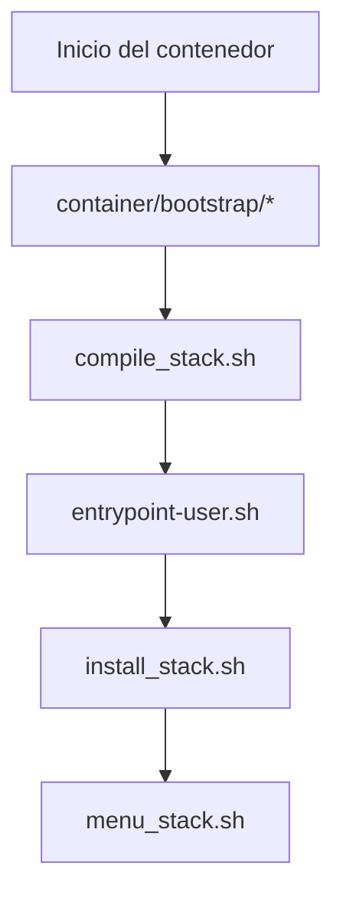

# Documentacion Docker-L4D2-Competitive

Esta carpeta documenta el modelo actual del proyecto base. La referencia vigente ya no gira alrededor del layout anterior, sino de:

1. `container/`
2. `installer/`
3. `stack/`

## Indice

### Primeros pasos

- [quick-start.md](quick-start.md): despliegue inicial.
- [configuration.md](configuration.md): variables, perfiles y configuracion avanzada.

### Operacion y runtime

- [l4d2-updater.md](l4d2-updater.md): actualizacion automatica del binario del juego.
- [scripts.md](scripts.md): mapa del bootstrap, installer y stack.
- [flowcharts.md](flowcharts.md): diagramas del flujo vigente.
- [api-reference.md](api-reference.md): contratos tecnicos, variables y formatos.

## Por donde empezar

### Si es tu primera vez

1. Lee [quick-start.md](quick-start.md).
2. Configura variables y perfiles en [configuration.md](configuration.md).
3. Revisa [scripts.md](scripts.md) para entender el runtime.

### Si vas a integrar o automatizar

- Revisa [api-reference.md](api-reference.md).
- Revisa [flowcharts.md](flowcharts.md).

## Arquitectura resumida

```text
Docker-L4D2-Competitive/
├── container/
├── installer/
│   ├── bin/
│   ├── lib/
│   └── config/
├── stack/
│   ├── manifests/
│   ├── profiles/
│   ├── hooks/
│   └── sources.json
└── docs/
```

## Flujo operativo


```mermaid
graph TD
    A[Inicio del contenedor] --> B[container/bootstrap/*]
    B --> C[compile_stack.sh]
    C --> D[entrypoint-user.sh]
    D --> E[install_stack.sh]
    E --> F[menu_stack.sh]
```

## Recomendaciones

- usa `STACK_PROFILE` como selector principal del stack
- deja `BRANCH_*` y `RELEASE_TAG_*` para pruebas puntuales
- trata `stack/sources.json` como snapshot materializado, no como modelo canonico

## Soporte

- repositorio: https://github.com/AoC-Gamers/Docker-L4D2-Competitive
- issues: https://github.com/AoC-Gamers/Docker-L4D2-Competitive/issues
