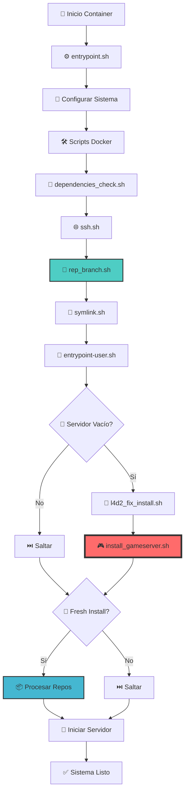
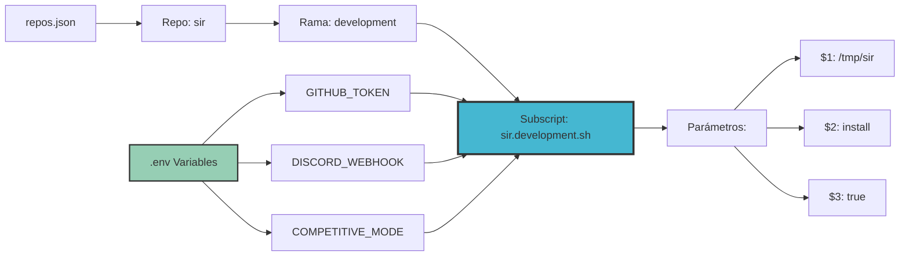

# Diagramas de Flujo del Sistema

## 📊 Diagrama 1: Flujo Completo de Instalación



## 🔧 Diagrama 2: Flujo Detallado de `install_gameserver.sh`

```mermaid
graph TD
    A[🎯 install_gameserver.sh] --> B[📋 Validar Variables]
    B --> C[📂 Cargar .env]
    C --> D[⚙️ Determinar Modo]
    
    D --> E{🔄 Tipo Instalación}
    E -->|install| F[🆕 Instalación Limpia]
    E -->|update| G[💾 Backup Configs (backup_files)]
    
    F --> H[🛠️ Preparar Bibliotecas Steam (mkdir .steam)]
    G --> I[🧹 Limpiar Directorios (verify_and_delete_dir)]
    I --> J[🔄 Restaurar Configs (restore_files)]
    J --> H
    
    H --> K[🗑️ Eliminar Conflictos (rm libstdc++/libgcc)]
    K --> L[📖 Leer repos.json (jq -c)]
    
    L --> M[🔄 Para cada repo]
    M --> N{🏷️ Modificar Rama?}
    
    N -->|Sí| O[🌿 Actualizar Rama (rep_branch.sh)]
    N -->|No| P[📊 Verificar Cambios (has_repo_changed)]
    O --> P
    
    P --> Q{📥 ¿Descargar?}
    Q -->|Forzar| R[🔄 Forzar Descarga (GIT_FORCE_DOWNLOAD)]
    Q -->|Cambios| S[📈 Hay cambios remotos (git ls-remote)]
    Q -->|Cache| T[💨 Usar caché local]
    
    R --> U[⬇️ Clonar Repositorio (git clone)]
    S --> U
    T --> V[📜 Buscar Subscript]
    U --> W[💾 Guardar Hash (save_commit_hash)]
    W --> V
    
    V --> X{📝 ¿Existe Subscript?}
    X -->|Sí| Y[⚡ Ejecutar Subscript (bash {folder}.{branch}.sh)]
    X -->|No| Z[⏭️ Continuar]
    
    Y --> AA[📤 Pasar Parámetros]
    AA --> |REPO_DIR| BB[📂 Directorio repo]
    AA --> |INSTALL_TYPE| CC[🔧 install/update]
    AA --> |GIT_DOWNLOAD| DD[📥 true/false]
    
    BB --> EE[🔧 Subscript Process]
    CC --> EE
    DD --> EE
    
    EE --> FF{🔄 ¿Más repos?}
    FF -->|Sí| M
    FF -->|No| GG[🔄 Restaurar Configs]
    
    Z --> FF
    GG --> HH[✅ Instalación Completa]
    
    style A fill:#ff6b6b,stroke:#333,stroke-width:4px
    style O fill:#4ecdc4,stroke:#333,stroke-width:2px
    style Y fill:#45b7d1,stroke:#333,stroke-width:3px
    style EE fill:#96ceb4,stroke:#333,stroke-width:2px
```

## 🎯 Puntos Clave del Sistema

### 🔄 Variables de Rama Dinámicas (`rep_branch.sh`)

```bash
# Configuración de entorno
export BRANCH_SIR=development
export BRANCH_CONFIGS=testing
export BRANCH_MY_PLUGIN=feature/new-update

# repos.json original:
{
  "folder": "sir",
  "branch": "default"  # ← Se modificará dinámicamente
}

# repos.json después de rep_branch.sh:
{
  "folder": "sir", 
  "branch": "development"  # ← Actualizado por variable BRANCH_SIR
}
```

### 📝 Sistema de Subscripts



### 🔧 Capacidades del Sistema

| Característica | Descripción | Ejemplo |
|---------------|-------------|---------|
| **Ramas Dinámicas** | Cambiar ramas por entorno | `BRANCH_SIR=development` |
| **Subscripts Personalizados** | Post-procesamiento por repo | `sir.development.sh` |
| **Variables .env** | Configuración global | `GITHUB_TOKEN`, `DISCORD_WEBHOOK` |
| **Caché Inteligente** | Solo descarga si hay cambios | Hash comparison |
| **Backup/Restore** | Preserva configuraciones | `backup_gameserver.json` |
| **URLs Dinámicas** | Variables en repos.json | `https://${TOKEN}@github.com/...` |

### 🎮 Casos de Uso Avanzados

#### 1. **Entorno de Desarrollo**
```bash
# Variables de entorno
export BRANCH_SIR=development
export BRANCH_CONFIGS=dev
export GITHUB_TOKEN=ghp_dev_token
export COMPETITIVE_MODE=false

# Resultado: Usa ramas de desarrollo con configuración de prueba
```

#### 2. **Entorno de Producción**
```bash
# Sin variables BRANCH_* = usa ramas por defecto de repos.json
export GITHUB_TOKEN=ghp_prod_token
export COMPETITIVE_MODE=true
export DISCORD_WEBHOOK_URL=https://discord.com/api/webhooks/prod/xxx

# Resultado: Usa ramas estables con configuración de producción
```

#### 3. **Testing de Features**
```bash
export BRANCH_SIR=feature/new-weapons
export BRANCH_CONFIGS=testing
export DEBUG_MODE=true

# Resultado: Prueba features específicas con configs de testing
```

Este sistema proporciona una **flexibilidad extrema** para gestionar diferentes entornos, ramas y configuraciones del servidor L4D2 competitivo.

## 📋 Mapeo de Funciones del Código

### 🔧 Funciones de `install_gameserver.sh`

| Paso del Diagrama | Función/Código | Líneas | Descripción |
|-------------------|----------------|--------|-------------|
| **Backup Configs** | `backup_files()` | 145-161 | Respalda archivos según `backup_gameserver.json` |
| **Limpiar Directorios** | `verify_and_delete_dir()` | 42-49 | Elimina directorios específicos de SourceMod |
| **Restaurar Configs** | `restore_files()` | 163-179 | Restaura archivos respaldados después de limpieza |
| **Preparar Bibliotecas** | `mkdir -p "$HOME/.steam/sdk32"` | 64-68 | Crea directorios para bibliotecas Steam |
| **Eliminar Conflictos** | `rm libstdc++.so.6 libgcc_s.so.1` | 76-86 | Elimina bibliotecas que causan conflictos |
| **Verificar Cambios** | `has_repo_changed()` | 115-125 | Compara hash local vs remoto |
| **Guardar Hash** | `save_commit_hash()` | 109-113 | Guarda hash del commit para caché |
| **Ejecutar Subscript** | `bash "$subscript_file"` | 255-257 | Ejecuta post-procesamiento personalizado |

### 🛠️ Secuencia de Limpieza (Modo Update)

```bash
# Líneas 190-208: Proceso de limpieza en modo update
if [ "$INSTALL_TYPE" == "update" ]; then
    backup_files "$BACKUP_JSON" "$DIR_SOURCEMOD"        # Respaldar configs
    
    verify_and_delete_dir "$DIR_SOURCEMOD/data"         # Limpiar directorios
    verify_and_delete_dir "$DIR_SOURCEMOD/extensions"
    verify_and_delete_dir "$DIR_SOURCEMOD/gamedata"
    verify_and_delete_dir "$DIR_SOURCEMOD/configs"
    verify_and_delete_dir "$DIR_SOURCEMOD/plugins"
    verify_and_delete_dir "$DIR_SOURCEMOD/scripting"
    verify_and_delete_dir "$DIR_SOURCEMOD/translations"
    
    clean_instance_logs                                 # Limpiar logs
    mkdir -p "$DIR_SOURCEMOD/configs"                   # Recrear configs
    
    verify_and_delete_dir "$DIR_CFG/cfgogl"            # Limpiar CFG
    verify_and_delete_dir "$DIR_CFG/sourcemod"
    verify_and_delete_dir "$DIR_CFG/stripper"
    
    restore_files "$BACKUP_JSON" "$DIR_SOURCEMOD"       # Restaurar configs
fi
```

### 🔄 Bucle Principal de Repositorios

```bash
# Líneas 211-259: Procesamiento de cada repositorio
jq -c '.[]' "$REPOS_JSON" | while IFS= read -r repo_item; do
    repo_url=$(echo "$repo_item" | jq -r '.repo_url' | envsubst)    # L217
    folder=$(echo "$repo_item" | jq -r '.folder')                   # L218
    branch=$(echo "$repo_item" | jq -r '.branch')                   # L219
    
    # Lógica de decisión de descarga (L221-240)
    if [[ "${GIT_FORCE_DOWNLOAD:-false}" == "true" ]]; then
        GIT_DOWNLOAD=true
    elif [[ -d "$folder" ]]; then
        remote_hash=$(git ls-remote "$repo_url" HEAD | awk '{print $1}')  # L226
        if has_repo_changed "$folder" "$remote_hash"; then                # L229
            GIT_DOWNLOAD=true
        fi
    fi
    
    # Clonación si es necesario (L242-251)
    if [[ "$GIT_DOWNLOAD" == "true" ]]; then
        git clone "$repo_url" "$folder"                             # L244-248
        latest_hash=$(get_latest_commit_hash "$folder")             # L249
        save_commit_hash "$folder" "$latest_hash"                   # L250
    fi
    
    # Ejecución de subscript (L253-259)
    subscript_file="$DIR_SCRIPTING/git-gameserver/${folder}.${branch}.sh"
    if [[ -f "$subscript_file" ]]; then
        bash "$subscript_file" "$folder" "$INSTALL_TYPE" "$GIT_DOWNLOAD"  # L256
    fi
done
```
