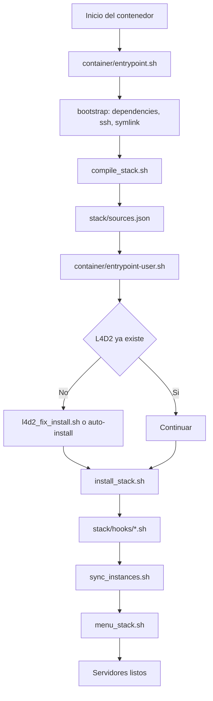
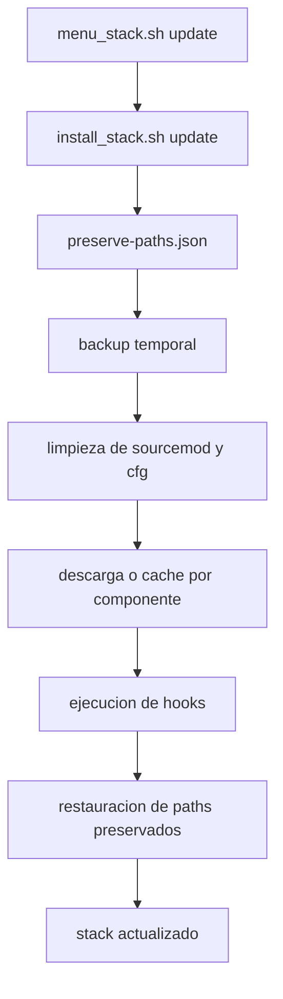

# Diagramas de Flujo del Sistema

## Flujo completo de arranque

```mermaid
graph TD
    A[Inicio del contenedor] --> B[container/entrypoint.sh]
    B --> C[bootstrap: dependencies, ssh, symlink]
    C --> D[compile_stack.sh]
    D --> E[stack/sources.json]
    E --> F[container/entrypoint-user.sh]
    F --> G{L4D2 ya existe}
    G -->|No| H[l4d2_fix_install.sh o auto-install]
    G -->|Si| I[Continuar]
    H --> J[install_stack.sh]
    I --> J
    J --> K[stack/hooks/*.sh]
    K --> L[sync_instances.sh]
    L --> M[menu_stack.sh]
    M --> N[Servidores listos]
```

## Flujo del stack

```mermaid
graph TD
    A[stack/manifests/components.json] --> C[compile_stack.sh]
    B[stack/profiles/STACK_PROFILE.json] --> C
    X[BRANCH_* y RELEASE_TAG_*] --> C
    C --> D[stack/sources.json]
    D --> E[install_stack.sh]
    E --> F{source_type}
    F -->|git| G[git clone o cache]
    F -->|github_release| H[GitHub API, download y extract]
    G --> I[hook por componente]
    H --> I
    I --> J[/data/serverfiles]
```

## Flujo de update

```mermaid
graph TD
    A[menu_stack.sh update] --> B[install_stack.sh update]
    B --> C[preserve-paths.json]
    C --> D[backup temporal]
    D --> E[limpieza de sourcemod y cfg]
    E --> F[descarga o cache por componente]
    F --> G[ejecucion de hooks]
    G --> H[restauracion de paths preservados]
    H --> I[stack actualizado]
```

## Mapa conceptual

### Bootstrap

- `container/entrypoint.sh`
- `container/bootstrap/dependencies_check.sh`
- `container/bootstrap/ssh.sh`
- `container/bootstrap/symlink.sh`
- `container/bootstrap/compile_stack.sh`

### Installer

- `installer/bin/install_stack.sh`
- `installer/bin/sync_instances.sh`
- `installer/bin/menu_stack.sh`
- `installer/bin/l4d2_fix_install.sh`
- `installer/lib/tools_stack.sh`

### Stack

- `stack/manifests/components.json`
- `stack/profiles/*.json`
- `stack/sources.json`
- `stack/hooks/*.sh`
- `stack/preserve-paths.json`

## Notas de migracion

Los diagramas antiguos del modelo repo-centrico ya no representan el flujo vigente. Ese modelo fue sustituido por:

- `compile_stack.sh`
- `install_stack.sh`
- `stack/sources.json`
- `stack/hooks/`
