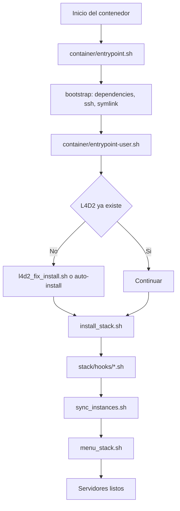
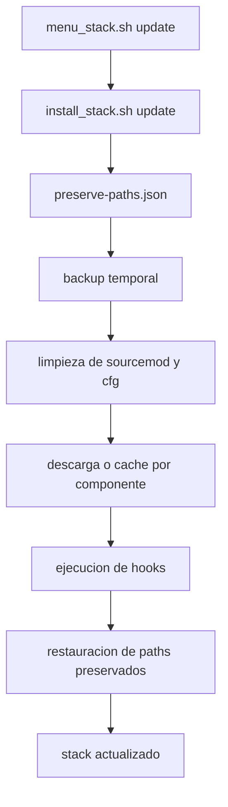

# Diagramas de Flujo del Sistema

## Flujo completo de arranque

```mermaid
graph TD
    A[Inicio del contenedor] --> B[container/entrypoint.sh]
    B --> C[bootstrap: dependencies, ssh, symlink]
    C --> D[container/entrypoint-user.sh]
    D --> E{L4D2 ya existe}
    E -->|No| F[l4d2_fix_install.sh o auto-install]
    E -->|Si| G[Continuar]
    F --> H[install_stack.sh]
    G --> H
    H --> I[stack/hooks/*.sh]
    I --> J[sync_instances.sh]
    J --> K[menu_stack.sh]
    K --> L[Servidores listos]
```

## Flujo del stack

```mermaid
graph TD
    A[stack/manifests/components.json] --> D[install_stack.sh]
    B[stack/profiles/STACK_PROFILE.json] --> D
    X[BRANCH_* y RELEASE_TAG_*] --> D
    D --> E{source_type}
    E -->|git| F[git clone o cache]
    E -->|github_release| G[GitHub API, download y extract]
    F --> H[hook por componente]
    G --> H
    H --> I[/data/serverfiles]
```

## Flujo de update

```mermaid
graph TD
    A[menu_stack.sh update] --> B[install_stack.sh update]
    B --> C[preserve-paths.json]
    C --> D[backup temporal]
    D --> E[limpieza de sourcemod y cfg]
    E --> F[descarga o cache por componente]
    F --> G[ejecucion de hooks]
    G --> H[restauracion de paths preservados]
    H --> I[stack actualizado]
```

## Mapa conceptual

### Bootstrap

- `container/entrypoint.sh`
- `container/bootstrap/dependencies_check.sh`
- `container/bootstrap/ssh.sh`
- `container/bootstrap/symlink.sh`

### Installer

- `installer/bin/install_stack.sh`
- `installer/bin/sync_instances.sh`
- `installer/bin/menu_stack.sh`
- `installer/bin/l4d2_fix_install.sh`
- `installer/lib/tools_stack.sh`

### Stack

- `stack/manifests/components.json`
- `stack/profiles/*.json`
- `stack/hooks/*.sh`
- `stack/preserve-paths.json`

## Notas de migracion

Los diagramas antiguos del modelo repo-centrico ya no representan el flujo vigente. Ese modelo fue sustituido por:

- `install_stack.sh`
- `stack/hooks/`
