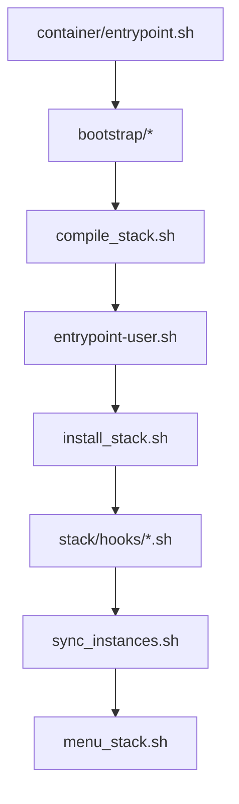

# Documentacion de Scripts

## Tabla de Contenidos

1. Vision General
2. Bootstrap del Contenedor
3. Comandos del Installer
4. Librerias del Installer
5. Catalogo del Stack
6. Flujo de Ejecucion

---

## Vision General

Competitive ya no organiza su logica operativa como `docker-scripts/` y `server-scripts/`. El modelo vigente se divide en:

1. `container/bootstrap/`: scripts de bootstrap del contenedor.
2. `installer/bin/`: comandos ejecutables del framework.
3. `installer/lib/`: utilidades compartidas.
4. `installer/config/`: configuracion operativa del installer.
5. `stack/`: catalogo, perfiles, snapshot y hooks.

## Bootstrap del Contenedor

### `container/entrypoint.sh`

Punto de entrada del contenedor. Exporta variables, prepara el runtime y ejecuta los scripts de `container/bootstrap/`.

### `container/entrypoint-user.sh`

Orquesta la fase de usuario LinuxGSM. Su flujo principal es:

1. Instalar o validar L4D2.
2. Ejecutar `l4d2_fix_install.sh` cuando corresponde.
3. Ejecutar `install_stack.sh` para materializar el stack.
4. Ejecutar `install_stack.sh update` antes del arranque si `L4D2_STACK_AUTOUPDATE=true`.
5. Sincronizar instancias adicionales con `sync_instances.sh`.
6. Lanzar `menu_stack.sh`.

### `container/bootstrap/compile_stack.sh`

Materializa `stack/sources.json` a partir de:

1. `stack/manifests/components.json`
2. `stack/profiles/{STACK_PROFILE}.json`
3. overrides `BRANCH_*` y `RELEASE_TAG_*`

Es el reemplazo semantico del flujo historico basado en `repos.json` y `rep_branch.sh`.

### `container/bootstrap/symlink.sh`

Crea los enlaces simbolicos entre el arbol inmutable de `/app` y el arbol operativo persistente de `/data`.

Estructura enlazada:

```text
/data/installer/bin/      -> /app/installer/bin/*
/data/installer/lib/      -> /app/installer/lib/*
/data/installer/config/   -> /app/installer/config/*
/data/stack/manifests/    -> /app/stack/manifests/*
/data/stack/profiles/     -> /app/stack/profiles/*
/data/stack/hooks/        -> /app/stack/hooks/*
```

### Otros scripts de bootstrap

- `dependencies_check.sh`: valida dependencias de runtime.
- `l4d2_updater.sh`: instala o actualiza el binario base del juego.
- `ssh_config.sh`: prepara acceso SSH y permisos.

## Comandos del Installer

### `installer/bin/install_stack.sh`

Es el comando principal del framework. Instala o actualiza el stack materializado en `stack/sources.json`.

Capacidades:

- soporta `source_type=git`
- soporta `source_type=github_release`
- resuelve assets por nombre exacto o `asset_name_glob`
- mantiene cache local y evita descargas innecesarias
- ejecuta hooks desde `stack/hooks/`

Uso:

```bash
./install_stack.sh install
./install_stack.sh update
```

Parametros de hook:

```bash
SOURCE_DIR
INSTALL_TYPE
SOURCE_DOWNLOAD
SOURCE_TYPE
```

### `installer/bin/sync_instances.sh`

Gestiona la sincronizacion de multiples instancias de L4D2 basadas en la instancia primaria.

### `installer/bin/menu_stack.sh`

Menu operativo del entorno LinuxGSM para iniciar, detener, reiniciar y consultar el estado de las instancias.

### `installer/bin/l4d2_fix_install.sh`

Aplica correcciones posteriores a la instalacion base del juego cuando el runtime lo necesita.

### `installer/bin/maps_l4d2center.sh`

Descarga mapas desde L4D2Center y los integra en el serverfiles.

### `installer/bin/workshop_downloader.sh`

Descarga y extrae contenido del Steam Workshop.

### `installer/bin/workshop.py`

Helper Python usado por el downloader del Workshop.

## Librerias del Installer

### `installer/lib/tools_stack.sh`

Libreria comun de shell. Centraliza helpers compartidos para:

- logging
- copias y sincronizacion de archivos
- extraccion de artefactos
- acceso a la API de GitHub
- descargas HTTP
- utilidades de instalacion de SourceMod y plugins

Los hooks deben cargar esta libreria via:

```bash
source "$DIR_INSTALLER_LIB/tools_stack.sh"
```

## Catalogo del Stack

### `stack/manifests/components.json`

Catalogo de componentes disponibles en el framework o en la distribucion derivada.

### `stack/profiles/*.json`

Seleccionan que componentes forman el stack activo y permiten overrides por perfil.

### `stack/sources.json`

Snapshot materializado del stack. Es el archivo consumido por `install_stack.sh`.

### `stack/hooks/*.sh`

Hooks por componente. Sustituyen el concepto historico de `git-gameserver/`.

Convencion:

```text
{folder}.{branch}.sh
```

Ejemplos:

```text
sir.default.sh
bansystem.develop.sh
l4d2_commsuite.default.sh
```

## Flujo de Ejecucion


