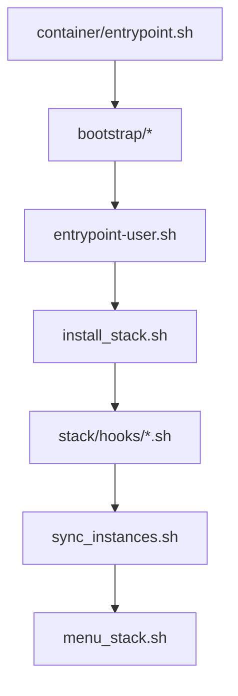

# Documentacion de Scripts

## Tabla de Contenidos

1. Vision General
2. Bootstrap del Contenedor
3. Comandos del Installer
4. Librerias del Installer
5. Catalogo del Stack
6. Flujo de Ejecucion

---

## Vision General

Competitive ya no organiza su logica operativa como `docker-scripts/` y `server-scripts/`. El modelo vigente se divide en:

1. `container/bootstrap/`: scripts de bootstrap del contenedor.
2. `installer/bin/`: comandos ejecutables del framework.
3. `installer/lib/`: utilidades compartidas.
4. `installer/config/`: configuracion operativa del installer.
5. `stack/`: catalogo, perfiles y hooks.

## Bootstrap del Contenedor

### `container/entrypoint.sh`

Punto de entrada del contenedor. Exporta variables, prepara el runtime y ejecuta los scripts de `container/bootstrap/`.

### `container/entrypoint-user.sh`

Orquesta la fase de usuario LinuxGSM. Su flujo principal es:

1. Ejecutar `deploy_stack.sh`.
2. Preparar o reparar L4D2 cuando corresponde.
3. Resolver el stack efectivo y reaplicarlo si cambio.
4. Sincronizar instancias con `sync_instances.sh`.
5. Lanzar `menu_stack.sh` para arranque u operacion del runtime.

### `container/bootstrap/symlink.sh`

Crea los enlaces simbolicos entre el arbol inmutable de `/app` y el arbol operativo persistente de `/data`.

Estructura enlazada:

```text
/data/installer/bin/      -> /app/installer/bin/*
/data/installer/lib/      -> /app/installer/lib/*
/data/installer/config/   -> /app/installer/config/*
/data/stack/manifests/    -> /app/stack/manifests/*
/data/stack/profiles/     -> /app/stack/profiles/*
/data/stack/hooks/        -> /app/stack/hooks/*
```

### Otros scripts de bootstrap

- `dependencies_check.sh`: valida dependencias de runtime.
- `l4d2_updater.sh`: instala o actualiza el binario base del juego.
- `ssh.sh`: prepara acceso SSH y permisos.

## Comandos del Installer

### `installer/bin/install_stack.sh`

Es el comando principal del framework. Resuelve e instala el stack a partir de `stack/manifests/components.json` y `stack/profiles/{STACK_PROFILE}.json`.

Capacidades:

- soporta `source_type=git`
- soporta `source_type=github_release`
- resuelve assets por nombre exacto o `asset_name_glob`
- mantiene cache persistente por perfil en `/data/installer/state/cache/`
- usa un workspace temporal aislado por corrida bajo `/app/tmp/install_stack/`
- puede degradar a reuse de cache local si la fuente remota no responde, siempre que el cache corresponda a la misma fuente efectiva
- ejecuta hooks desde `stack/hooks/`

Uso:

```bash
./install_stack.sh install
./install_stack.sh update
```

Parametros de hook:

```bash
SOURCE_DIR
INSTALL_TYPE
SOURCE_DOWNLOAD
SOURCE_TYPE
```

### `installer/bin/sync_instances.sh`

Gestiona la sincronizacion de multiples instancias de L4D2 basadas en la instancia primaria.

Comportamiento actual:

- crea instancias faltantes
- rehace el layout `sourcemodN` aunque ya exista
- elimina instancias sobrantes cuando baja la topologia objetivo
- mezcla enlaces simbolicos y copias reales segun `installer/config/instances_exclude.json`
- persiste el resultado en `instances-state.json`

`instances_exclude.json` se evalua por arbol de SourceMod (`bin`, `configs`, `data`, `extensions`, `gamedata`, `plugins`, `translations`). Cada lista acepta rutas relativas dentro de ese arbol. Ejemplo:

```json
{
  "data": [
    "dumps",
    "sqlite/local-backups"
  ]
}
```

Con eso, `data/dumps` y `data/sqlite/local-backups` se copian fisicamente a cada instancia, mientras el resto de `data/` puede seguir enlazado.

### `installer/bin/menu_stack.sh`

Menu operativo del entorno LinuxGSM para iniciar, detener, reiniciar y consultar el estado de las instancias.

Notas de flujo:

- el update automatico hace stop/update/start
- el update manual hace stop/update y deja las instancias detenidas para arranque explicito
- si detecta drift entre runtime e `instances-state.json`, ejecuta `sync_instances.sh`

### `installer/bin/l4d2_fix_install.sh`

Aplica correcciones posteriores a la instalacion base del juego cuando el runtime lo necesita.

### `installer/bin/maps_l4d2center.sh`

Descarga mapas desde L4D2Center y los integra en el serverfiles.

### `installer/bin/workshop_downloader.sh`

Descarga y extrae contenido del Steam Workshop.

### `installer/bin/workshop.py`

Helper Python usado por el downloader del Workshop.

## Librerias del Installer

### `installer/lib/tools_stack.sh`

Libreria comun de shell. Centraliza helpers compartidos para:

- logging
- extraccion de artefactos
- acceso a la API de GitHub
- descargas HTTP
- utilidades generales del installer

Los hooks deben cargar esta libreria via:

```bash
source "$DIR_INSTALLER_LIB/tools_stack.sh"
```

### `installer/lib/stack_component_lib.sh`

Libreria base para hooks de componentes. Centraliza helpers compartidos para:

- persistencia puntual de variables en `/etc/environment`
- sincronizacion de arboles `addons/`, `sourcemod/`, `cfg/` y `scripts/`
- instalacion acumulativa por arbol como politica recomendada del stack
- movimiento de plugins a subdirectorios como `custom/`
- limpieza de paths excluidos luego del deploy
- validacion de comandos requeridos
- resolucion y descarga de tarballs remotos
- validacion y extraccion cacheada de artefactos locales en `REPO_RESOURCES_DIR`
- edicion por lotes de archivos con `sed`

Los hooks que manipulan componentes deben cargarla junto a `tools_stack.sh`:

```bash
source "$DIR_INSTALLER_LIB/tools_stack.sh"
source "$DIR_INSTALLER_LIB/stack_component_lib.sh"
```

## Catalogo del Stack

### `stack/manifests/components.json`

Catalogo de componentes disponibles en el framework o en la distribucion derivada.

### `stack/profiles/*.json`

Seleccionan que componentes forman el stack activo y permiten overrides por perfil.

### `stack/hooks/*.sh`

Hooks por componente.

Convencion:

```text
{folder}.{branch}.sh
```

Ejemplos:

```text
sir.default.sh
bansystem.develop.sh
l4d2_commsuite.default.sh
```

En general, los hooks `*.develop.sh` deben ser wrappers minimos que delegan al `*.default.sh`. Solo conviene mantener logica propia en `develop` cuando realmente hay comportamiento distinto para ese canal.

En este stack, los hooks deben preferir `stack_install_*` para no borrar archivos criticos del motor, mapas custom u overlays ya materializados. `stack_replace_*` queda solo para casos excepcionales y auditados.

## Flujo de Ejecucion


```mermaid
graph TD
    A[container/entrypoint.sh] --> B[bootstrap/*]
    B --> C[entrypoint-user.sh]
    C --> D[install_stack.sh]
    D --> E[stack/hooks/*.sh]
    E --> F[sync_instances.sh]
    F --> G[menu_stack.sh]
```
